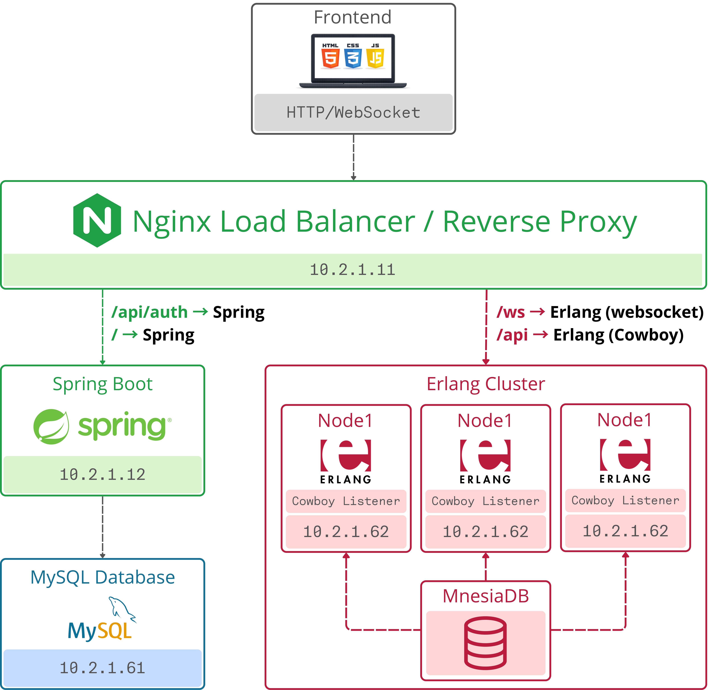

# Distributed Betting System

Distributed Betting System is an academic project developed for the course  
**Distributed Systems and Middleware Technologies** (MSc in Computer Engineering, University of Pisa).

The project implements a **distributed online betting platform** designed to support real-time betting with dynamically updated odds, while ensuring **data consistency, fault tolerance, and scalability** across multiple backend nodes.

---

## Overview

The system allows users to place bets on real and virtual events with odds that change dynamically according to the distribution of placed bets.  
A key design goal is guaranteeing fairness and correctness in a highly concurrent environment, where multiple users may place bets simultaneously on the same event.

To achieve this, the platform leverages:
- a **distributed Erlang cluster** for core betting logic,
- **transactional state management** using Mnesia,
- **real-time communication** via WebSockets,
- and a clear separation between authentication and game logic.

---

## System Architecture

The system is composed of three main subsystems: a load balancing layer, an authentication/frontend service, and a distributed game service cluster.

### Components

#### Nginx Load Balancer / Reverse Proxy
- Acts as the single entry point for all client requests.
- Performs round-robin load balancing across Erlang nodes.
- Routes:
  - `/api/auth/*` and `/` to the Spring Boot server,
  - `/api/*` to the Erlang cluster (Cowboy HTTP),
  - `/ws` to Erlang nodes for WebSocket connections.
- Prevents direct external access to internal services.

#### Spring Boot Server
- Handles user registration and authentication.
- Issues JWT tokens used across the system.
- Serves the web frontend.
- Persists user credentials and roles in a MySQL database.
- Does not manage betting logic or balances.

#### Erlang Cluster
- Core of the betting platform.
- Consists of multiple Erlang nodes using native distributed features.
- Responsibilities:
  - game creation and lifecycle management,
  - bet placement and validation,
  - dynamic odds and betting cap calculation,
  - payout processing,
  - real-time event broadcasting.
- Each node runs:
  - Cowboy HTTP server for REST APIs,
  - WebSocket handlers,
  - a broadcast dispatcher,
  - a local replica of the Mnesia database.

#### Databases
- **MySQL**: stores authentication data only (users, roles).
- **Mnesia**: distributed database replicated across Erlang nodes, storing:
  - user balances,
  - games and their state,
  - bets,
  - internal counters.

---

## Key Features

- Dynamic odds calculation based on current bet distribution.
- Betting caps to limit bookmaker exposure.
- Real-time frontend updates without polling.
- Atomic and fault-tolerant operations using Mnesia transactions.
- JWT-based stateless authentication across heterogeneous services.
- Horizontal scalability and tolerance to node failures.
- Consistent user experience under concurrent access.

---

## Coordination and Consistency

The distributed nature of the system introduces several challenges, all addressed in the design:

- **Odds locking**: a bet is accepted only if the odds at submission time match the current odds.
- **Atomic bet placement**: balance updates, odds updates, and bet recording occur within a single transaction.
- **Fault tolerance**: partial failures do not leave the system in an inconsistent state.
- **Event synchronization**: creation, closure, and settlement of games are immediately propagated to all nodes and clients.
- **Race condition handling**: frontend balance updates are ordered using a strictly increasing sequence number.

---

## Communication Model

- REST APIs for synchronous operations (bets, balances, administration).
- WebSockets for real-time updates:
  - odds changes,
  - new events,
  - bet confirmations,
  - balance updates,
  - game results.
- Broadcast messages are propagated cluster-wide through dispatcher processes on each Erlang node.

---

## Educational Context

This project is intended for **educational and experimental purposes**.  
It demonstrates the design and implementation of a real-world distributed system, combining concepts such as:
- distributed state replication,
- coordination under concurrency,
- fault tolerance,
- real-time communication,
- service separation and load balancing.

---

## Credits

This README was generated by **ChatGPT** based on the official project report.  

---

## Meta-credits

**ChatGPT** also wrote this credit.
