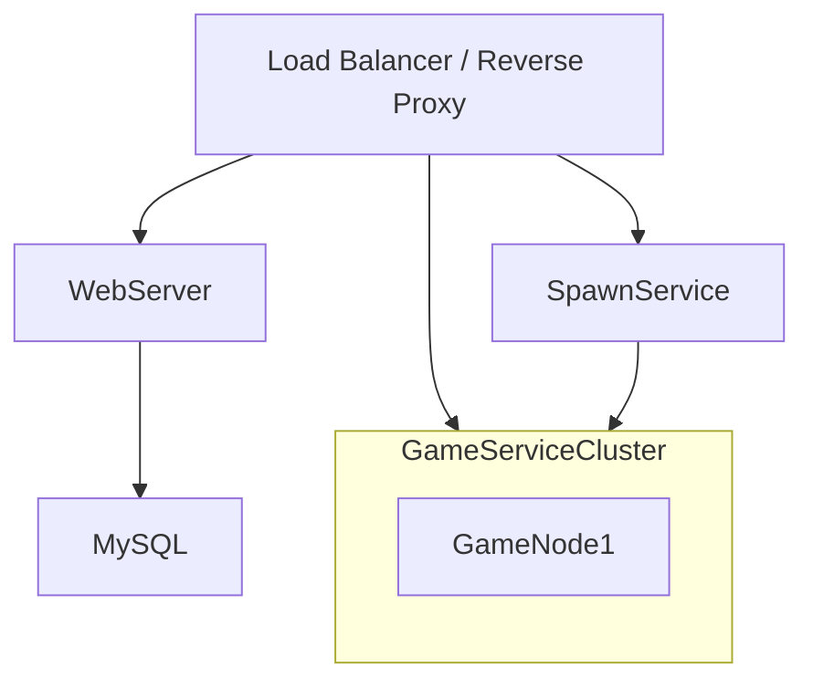

# distributed_betting_system

## architecture of the system

```mermaid
graph TD
    %% ===== Livello 1: Load Balancer =====
    LB[Load Balancer / Reverse Proxy]

    %% ===== Livello 2: Servizi affiancati =====
    WS[WebServer]
    SPAWN[SpawnService]

    %% ===== Livello 3: Game Cluster =====
    subgraph GAME_CLUSTER[GameServiceCluster]
        direction TB
        NODE1[GameNode1]
    end

    %% ===== Livello 3: Database =====
    SQL[MySQL]

    %% ===== Collegamenti =====
    LB --> WS
    LB --> SPAWN
    LB --> GAME_CLUSTER
    SPAWN --> GAME_CLUSTER
    WS --> SQL

```
