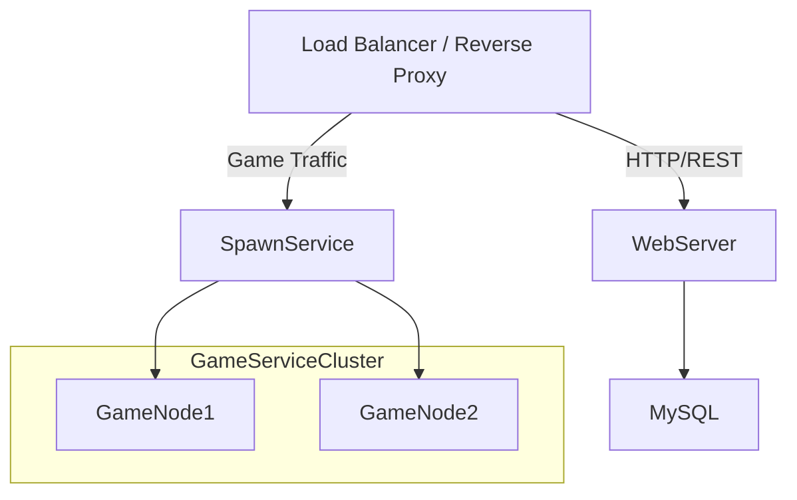

# distributed_betting_system

## Architecture

1. load balancer that acts also as reverse proxy (unified IP from outside) `10.2.1.11`
2. WEB server for serving web application and REST endpoints for authenticatino with JWT `10.2.1.12`
3. MySQL database for user information `10.2.1.27`
4. Main Erlang process for spawning erlang processes `10.2.1.28`
5. Two machines for spawning Erlang game processes `10.2.1.XX/XX`

diagram of the design

